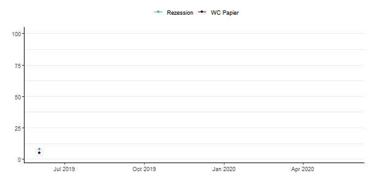
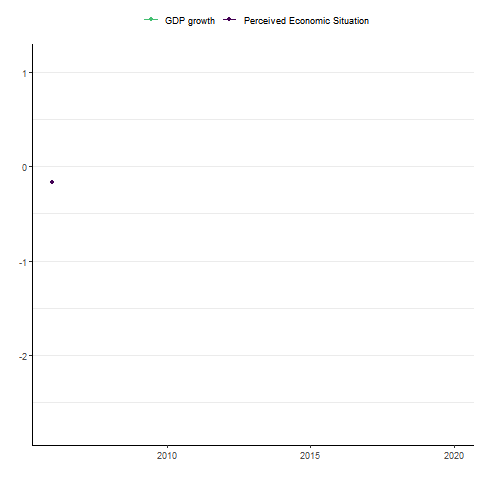
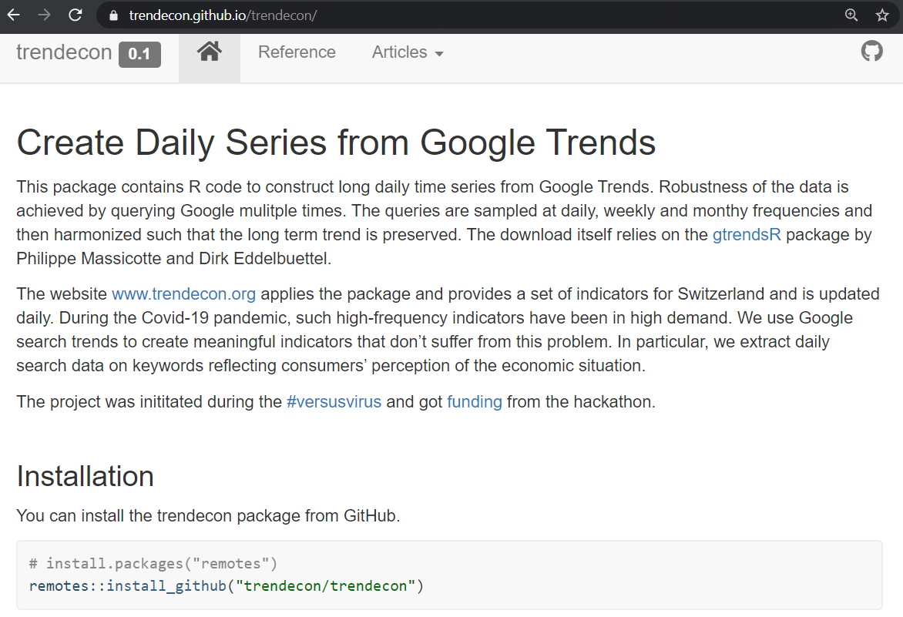
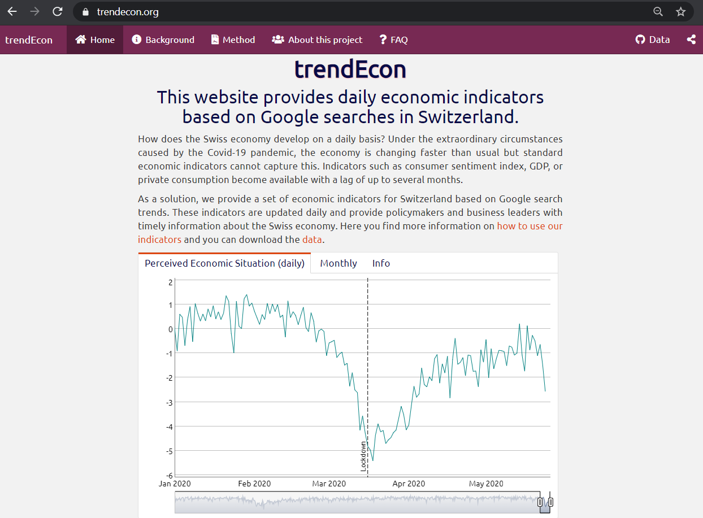

exclude: true
<style type="text/css">
code.r{
  font-size: 16px;
}
pre {
  font-size: 16px !important;
}
</style>
```{r setup, include=FALSE}
options(htmltools.dir.version = FALSE)
```
---
class: bg-main1

# Why trendEcon?
<br><br>

--
### During the Covid-19 pandemic, information about the economic and social situation has changed rapidly. `r emo::ji("metrics")`
<br><br>

--
### Traditional indicators are *not sufficiently frequent* to monitor and forecast economic and social activity at high frequency `r emo::ji("clock")`

---
class: bg-main1

# Our solution

--
### We use Google search trends to overcome this data gap and create meaningful indicators. 

--
### We extract daily search data on keywords reflecting consumers' perception.



---
layout: true
class: split-two with-border border-white

.column[
  .split-three[
  .row.bg-main1[.content.font2[
Indicators based on Google Trends.
  ]]
  .row.bg-main2[.content.font2[
R package .yellow[trendecon]
  ]]
  .row.bg-main3[.content.font2[
Website .yellow[www.trendecon.org] using flexdashboard.
]]
]]

.column.bg-main1[.content.center.vmiddle[
{{content}}
]]

---
class: hide-row2-col1 hide-row3-col1


---
class: hide-row3-col1


---
class:


---
class: fade-row2-col1 fade-row3-col1


---
layout: false
class: bg-main1

# General steps
.blockquote.font_large[
Use Google Trends data for keywords such as “Wirtschaftskrise” and “Insolvenz”. </br></br>
]
 
---
class: bg-main1

# General steps
.blockquote.font_large[
Use Google Trends data for keywords such as “Wirtschaftskrise” and “Insolvenz”. </br></br>
Retrieve Google Trends data through the Google API.</br></br>
]
 
---
class: bg-main1

# General steps
.blockquote.font_large[
Use Google Trends data for keywords such as “Wirtschaftskrise” and “Insolvenz”. </br></br>
Retrieve Google Trends  data through the Google API.</br></br>
Construct indicators.</br></br>
]
 
---
class: bg-main1

# General steps
.blockquote.font_large[
Use Google Trends data for keywords such as “Wirtschaftskrise” and “Insolvenz”. </br></br>
Retrieve Google Trends data through the Google API.</br></br>
Construct indicators.</br></br>
Compare the data to existing economic indicators.</br></br>
]

---
class: middle bg-main1

# It looks very simple....but


---
class: bg-main1

#Sampling issues
##If you query Google Trends for a search term, e.g., insolvenz, the result is based on a subsample of all search results.
</br>
--
```{r, echo=FALSE, fig.height=5, fig.width=15, message=FALSE, warning=FALSE}
library(trendecon)
since2015 <- ts_gtrends("insolvenz", geo = "CH")
since2004 <- ts_gtrends("insolvenz", geo = "CH", time = "all")
tsbox::ts_plot(since2004,since2015)
```
--

---
class: bg-main1

#Available data
</br>
##Google search results are available on a daily, weekly or monthly frequency. 
</br>
##Our goal is to produce long daily time series, ideally from 2006, but Google does not provide daily or weekly data for such a long time period. 

---
class: bg-main1

# Making your R work .yellow[organized] and .yellow[portable]
##Where does your analysis .yellow["live"]
</br>
</br>
</br>
###Setting your working directory (path)
</br>
</br>
`setwd("C:/users/will/my_data")`
</br>
</br>
`getwd()`
---
class: bg-main1

#What do you do when you open R?
</br>
</br>
--
.float-left[]
--
.float-right[]
---
class: bg-main1

.float-left[]
--
.float-right[]
--
</br>
</br>
.font_large[`setwd("will/folder-that-only-exists-on-this-computer")`]

---
class: bg-main1 vmiddle center


---
class: split-25 bg-main1 with-border

.row[
#What .yellow[should] you do when you open R?]
.row[
  .split-three.with-border[
  .column.bg-orange[.content[
#Open (or make) an R project


    ]]
  .column[.content[
  
  ]]
  .column[.content[
  
  ]]
]]
---
class: bg-main1

#What is an R project?
.font_large[
+ A way to keep all files (scripts, inputs, figures) associated with a project organized in one place</br></br>

]
---
class: bg-main1

#What is an R project?
.font_large[
+ A way to keep all files (scripts, inputs, figures) associated with a project organized in one place</br></br>
+ Many useful options for saving your R history or environment</br></br>

]
---
class: bg-main1

#What is an R project?
.font_large[
+ A way to keep all files (scripts, inputs, figures) associated with a project organized in one place</br></br>
+ Many useful options for saving your R history or environment</br></br>
+ keeps your files and scripts in a centralized working directory</br></br>

]
---
class: bg-main1

#What is an R project?
.font_large[
+ A way to keep all files (scripts, inputs, figures) associated with a project organized in one place</br></br>
+ Many useful options for saving your R history or environment</br></br>
+ keeps your files and scripts in a centralized working directory</br></br>
+ allows for version control and portability</br>
]
---
class: bg-main1

#What is an R project?
.font_large[
+ A way to keep all files (scripts, inputs, figures) associated with a project organized in one place</br></br>
+ Many useful options for saving your R history or environment</br></br>
+ keeps your files and scripts in a centralized working directory</br></br>
+ allows for version control and portability</br>
]


---
class: split-25 bg-main1 fade-row2-col1 with-border

.row[
#What .yellow[should] you do when you open R?]
.row[
  .split-three.with-border[
  .column[.content[
#Open (or make) an R project


    ]]
  .column.bg-orange[.content[
#git pull
.center[]
  ]]
  .column[.content[
  
  ]]
]]
---
class: bg-main1 vmiddle


---
class: bg-main1 
#What is version control?
--
.center[]
---
class: bg-main1 vmiddle center

---
class: bg-main1
#Integrate GitHub with R projects

.float-left[]
--
.float-right[]</br>
--
.font_large[This guide by Hadley Wickham is my all-time favorite explanation of git/github and how it integrates with R]
</br>
</br>
.font_large[<a href="http://r-pkgs.had.co.nz/git.html" target="_blank">http://r-pkgs.had.co.nz/git.html</a>]
---
class: split-25 bg-main1 fade-row2-col1 fade-row2-col2 with-border
.row[
#What .yellow[should] you do when you open R?]
.row[
  .split-three.with-border[
  .column[.content[
#Open (or make) an R project


    ]]
  .column[.content[
#git pull
.center[]
  ]]
  .column.bg-orange[.content[
#Write code, save scripts and results, commit change, and push to github
  
  ]]
]]
---
class: bg-main1 
#Now, just write the code...
</br>
</br>
--
.center[]
---
class: split-two with-border border-white fade-row1-col1 fade-row3-col1
.column[
  .split-three[
  .row.bg-main1[.content.font2[
Write .yellow[organized] and .yellow[portable] R code
  ]]
  .row.bg-main2[.content.font2[
Write .yellow[readable] R code
  ]]
  .row.bg-main3[.content.font2[
Document, share, and .yellow[learn] more R code
]]
]]
.column.bg-main1[.content.center.vmiddle[

]]
---
class: bg-main1
#What is the .yellow[tidyverse?]
</br>
</br>
.center[]
---
class: bg-main1
#What is the .yellow[tidyverse?]
</br>
</br>
.center[]
---
class: bg-main1
#Why use the .yellow[tidyverse?]
</br>
</br>
.font_large[
+ Makes coding simpler
]
---
class: bg-main1
#Why use the .yellow[tidyverse?]
</br>
</br>
.font_large[
+ Makes coding simpler
</br>
</br>
+ Makes code more human-readable
]
---
class: bg-main1
#Why use the .yellow[tidyverse?]
</br>
</br>
.font_large[
+ Makes coding simpler
</br>
</br>
+ Makes code more human-readable
</br>
</br>
+ Makes coding more fun and enjoyable
]
---
class: bg-main1
#Writing .yellow[readable] code
</br>
</br>
--
.blockquote.font_large[
Always code as if the guy who ends up maintaining your code will be a violent psychopath who knows where you live.</br>
-_John Woods_
]
--
</br>
</br>
.font_large[Spoiler alert: ]

---
class: bg-main1
#Writing .yellow[readable] code
</br>
</br>

.blockquote.font_large[
Always code as if the guy who ends up maintaining your code will be a .yellow[violent psychopath who knows where you live.]</br>
-_John Woods_
]
</br>
</br>
.font_large[Spoiler alert: .yellow[that's you]]
---
class: bg-main1
#Writing .yellow[readable] code
</br>
</br>
##Envison how you want your data to look, then map out the steps to get from your current data to the desired format
###Write them out!


---
class: bg-main1 font_small
```{r message = F}
library(tidyverse)
#Data
data <- tibble(
  subject_ID = c(15243, 23112, 45765, 92992, 85828),
  subject_sex = c("male", "female", "female", "male", "male"),
  subject_age = c(22, 20, 20, 18, 18),
  course_rating = c("fair", "good", "bad", "good", "bad"),
  subject_GPA = c(2.2, 3.8, 3.0, 3.7, NA),
  subject_major = c("Biology", "biology/statistics", "Anthropology", "anthropology/Biology", "Anthropology")
)
options(tibble.width = Inf, width = 150)
data
```
---
class: bg-main1
```{r echo=F}
options(tibble.width = Inf, width = 150)
data
```
</br>
.font_large[
Goal: calculate average GPA based on course rating
]
---
class: bg-main1
```{r echo=F}
options(tibble.width = Inf, width = 150)
data
```
</br>
.font_large[
Goal: calculate average GPA based on course rating
</br>
1. `filter` observations with no GPA value
]
---
class: bg-main1
```{r echo=F}
options(tibble.width = Inf, width = 150)
data
```
</br>
.font_large[
Goal: calculate average GPA based on course rating
</br>
1. `filter` observations with no GPA value
</br>
</br>
2. `select` columns of interest
]
---
class: bg-main1
```{r echo=F}
options(tibble.width = Inf, width = 150)
data
```
</br>
.font_large[
Goal: calculate average GPA based on course rating
</br>
1. `filter` observations with no GPA value
</br>
</br>
2. `select` columns of interest
</br>
</br>
3. `group_by` course rating
]
---
class: bg-main1
```{r echo=F}
options(tibble.width = Inf, width = 150)
data
```
</br>
.font_large[
Goal: calculate average GPA based on course rating
</br>
1. `filter` observations with no GPA value
</br>
</br>
2. `select` columns of interest
</br>
</br>
3. `group_by` course rating
</br>
</br>
4. `summarize` GPA as mean value
]

---
class: bg-main1
#Sidebar: WTF is .yellow[`%>%`]
</br>
</br>
.font_large[`input %>% operation`]
</br>
</br>
.font_large[read as .yellow["pipe to"] or .yellow["THEN"]]
---
class: bg-main1
##Goal: calculate average GPA based on course rating
.font_medium[
1. `filter` observations with no GPA value
</br>
</br>
2. `select` columns of interest
</br>
</br>
3. `group_by` course rating
</br>
</br>
4. `summarize` GPA as mean value
]
###Make a new dataframe for each step
```{r eval=F}
data2 <- filter(data, is.na(subject_GPA) == FALSE)
data3 <- select(data2, subject_GPA, course_rating)
data4 <- group_by(data3, course_rating)
data5 <- summarize(data4, avg_GPA = mean(subject_GPA))
```
--
###Replace the old data for each step
```{r eval=F}
data <- filter(data, is.na(subject_GPA) == FALSE)
data <- select(data, subject_GPA, course_rating)
data <- group_by(data, course_rating)
data <- summarize(data, avg_GPA = mean(subject_GPA))
```
---
class: bg-main1
##Write a nested expression
```{r eval=F}
avg_gpa <- 
  summarize(
    group_by(
      select(
        filter(data, is.na(subject_GPA) == FALSE),
      subject_GPA, course_rating),
    course_rating),
  avg_GPA = mean(subject_GPA))
```
--

---
class: bg-main1
##The dplyr way
```{r}
avg_gpa <- data %>%
  filter(is.na(subject_GPA) == F) %>%
  select(subject_GPA, course_rating) %>%
  group_by(course_rating) %>%
  summarize(avg_GPA = mean(subject_GPA))
```
--
```{r echo=F}
avg_gpa
```
---
class: bg-main1
#Make a messy table into polished format
```{r echo=F}
data <- tibble(
  subject_ID = c(15243, 23112, 45765, 92992, 85828),
  subject_sex = c("male", "female", "female", "male", "male"),
  subject_age = c(22, 20, 20, 18, 18),
  course_rating = c("ok", "great", "terrible", "amazing", "horrible"),
  subject_GPA = c(2.2, 3.8, 3.0, 3.7, NA),
  subject_major = c("Biology", "biology/statistics", "Anthropology", "anthropology/Biology", "Anthropology")
)
options(tibble.width = Inf, width = 150)
data
```
##What we want to do:
</br>
.font_large[
1. Standardize the `course_rating` categories
]
---
class: bg-main1
#Make a messy table into polished format
```{r echo=F}
data <- tibble(
  subject_ID = c(15243, 23112, 45765, 92992, 85828),
  subject_sex = c("male", "female", "female", "male", "male"),
  subject_age = c(22, 20, 20, 18, 18),
  course_rating = c("ok", "great", "terrible", "amazing", "horrible"),
  subject_GPA = c(2.2, 3.8, 3.0, 3.7, NA),
  subject_major = c("Biology", "biology/statistics", "Anthropology", "anthropology/Biology", "Anthropology")
)
options(tibble.width = Inf, width = 150)
data
```
##What we want to do:
</br>
.font_large[
1. Standardize the `course_rating` categories
</br>
</br>
2. Clean up the `subject_major` column
]
---
class: bg-main1
#Make a messy table into polished format
```{r echo=F}
data <- tibble(
  subject_ID = c(15243, 23112, 45765, 92992, 85828),
  subject_sex = c("male", "female", "female", "male", "male"),
  subject_age = c(22, 20, 20, 18, 18),
  course_rating = c("ok", "great", "terrible", "amazing", "horrible"),
  subject_GPA = c(2.2, 3.8, 3.0, 3.7, NA),
  subject_major = c("Biology", "biology/statistics", "Anthropology", "anthropology/Biology", "Anthropology")
)
options(tibble.width = Inf, width = 150)
data
```
##What we want to do:
</br>
.font_large[
1. Standardize the `course_rating` categories
</br>
</br>
2. Clean up the `subject_major` column
</br>
</br>
3. Reorder and rename the columns
]
---
class: bg-main1
#Make a messy table into polished format
```{r echo=F}
data <- tibble(
  subject_ID = c(15243, 23112, 45765, 92992, 85828),
  subject_sex = c("male", "female", "female", "male", "male"),
  subject_age = c(22, 20, 20, 18, 18),
  course_rating = c("ok", "great", "terrible", "amazing", "horrible"),
  subject_GPA = c(2.2, 3.8, 3.0, 3.7, NA),
  subject_major = c("Biology", "biology/statistics", "Anthropology", "anthropology/Biology", "Anthropology")
)
options(tibble.width = Inf, width = 150)
data
```
```{r warning=F, message=F}
data %>% 
  mutate(course_rating = 
           case_when(
             course_rating == "ok" ~ "fair",
             course_rating == "great" | course_rating == "amazing" ~ "good",
             course_rating == "terrible" | course_rating == "horrible" ~ "bad"
        ))
```
---
class: bg-main1
#Make a messy table into polished format
```{r echo=F}
data <- tibble(
  subject_ID = c(15243, 23112, 45765, 92992, 85828),
  subject_sex = c("male", "female", "female", "male", "male"),
  subject_age = c(22, 20, 20, 18, 18),
  course_rating = c("ok", "great", "terrible", "amazing", "horrible"),
  subject_GPA = c(2.2, 3.8, 3.0, 3.7, NA),
  subject_major = c("Biology", "biology/statistics", "Anthropology", "anthropology/Biology", "Anthropology")
)
options(tibble.width = Inf, width = 150)
data
```
```{r warning=F, message=F, eval=F}
data %>%
  mutate(subject_major = tolower(subject_major)) %>%
  tidyr::separate(subject_major, into = c("major_1", "major_2"), sep="/") %>%
  mutate(double_major = 
           case_when(
             is.na(major_2) == FALSE ~ "yes",
             is.na(major_2) == TRUE ~ "no"
        ))
```
```{r echo=F, warning=F}
data %>% 
  mutate(course_rating = 
           case_when(
             course_rating == "ok" ~ "fair",
             course_rating == "great" | course_rating == "amazing" ~ "good",
             course_rating == "terrible" | course_rating == "horrible" ~ "bad"
        )) %>%
  mutate(subject_major = tolower(subject_major)) %>%
  tidyr::separate(subject_major, into = c("major_1", "major_2"), sep="/") %>%
  mutate(double_major = 
           case_when(
             is.na(major_2) == FALSE ~ "yes",
             is.na(major_2) == TRUE ~ "no"
        ))
```
---
class: bg-main1
#Make a messy table into polished format
```{r eval=F}
data %>%
  arrange(course_rating) %>%
  select("Subject ID" = subject_ID, 
         "Course Rating" = course_rating, 
         "Subject Age" = subject_age,
         "Subject GPA" = subject_GPA,
         "Double Major" = double_major,
         "First Major" = major_1,
         "Second Major" = major_2)
```
```{r echo=F, warning=F}
data %>% 
  mutate(course_rating = 
           case_when(
             course_rating == "ok" ~ "fair",
             course_rating == "great" | course_rating == "amazing" ~ "good",
             course_rating == "terrible" | course_rating == "horrible" ~ "bad"
        )) %>%
  mutate(subject_major = tolower(subject_major)) %>%
  tidyr::separate(subject_major, into = c("major_1", "major_2"), sep="/") %>%
  mutate(double_major = 
           case_when(
             is.na(major_2) == FALSE ~ "yes",
             is.na(major_2) == TRUE ~ "no"
        )) %>%
  arrange(course_rating) %>%
  select("Subject ID" = subject_ID, 
         "Course Rating" = course_rating, 
         "Subject Age" = subject_age,
         "Subject GPA" = subject_GPA,
         "Double Major" = double_major,
         "First Major" = major_1,
         "Second Major" = major_2)
```
---
class: bg-main1
#One more example: .yellow[wide] to .yellow[long] format
.pull-left[]
.pull-right.font_medium[
+ Generally, wide format is better for presentation, and long format is better for plotting or doing analysis
+ But these are also useful functions for general data wrangling
]
---
class: bg-main1
.font_large[Here's our .yellow[wide] format data:]
```{r echo=F}
data <- tibble(
  subject_ID = c(15243, 23112, 45765, 92992),
  course_rating = c("fair", "good", "bad", "good"),
  grade_1 = c(70, 95, 80, 92),
  grade_2 = c(65, 94, 86, 87), 
  grade_3 = c(83, 91, 89, 100)
)
data
```
.font_large[Go from .yellow[wide] to .yellow[long] format with `tidyr::gather()`]
```{r}
plot_data <- data %>%
  select(-subject_ID) %>%
  tidyr::gather(key = subject_attribute, value = value, -course_rating)
```
```{r echo=F}
plot_data
```
---
class: bg-main1
#.yellow[Wide] to .yellow[long] format
```{r fig.width=7, fig.height=6}
ggplot(plot_data, aes(x = course_rating, y = value, color = subject_attribute)) + 
  geom_point(size = 3) + 
  scale_color_viridis_d() + 
  theme_light()
```
---
class: split-two with-border border-white fade-row1-col1 fade-row2-col1

.column[
  .split-three[
  .row.bg-main1[.content.font2[
Write .yellow[organized] and .yellow[portable] R code
  ]]
  .row.bg-main2[.content.font2[
Write .yellow[readable] R code
  ]]
  .row.bg-main3[.content.font2[
Document, share, and .yellow[learn] more R code
]]
]]

.column.bg-main1[.content.center.vmiddle[

]]
---
class: bg-main1 vmiddle center
#A plug for (maybe) my .yellow[favorite] thing in R
---
class: bg-main1
##.yellow[Document] your analyses, make a .yellow[website], write your .yellow[thesis], make .yellow[slides]... the world is your oyster!
.center[]
---
class: bg-main1
#Where can I .yellow[learn] more</br>
--
Read this (free) book
.font_large[http://r4ds.had.co.nz/]


---
class: bg-main1
#And this one!
.center[]
---
class: bg-main1
#Where can I .yellow[learn] more </br>
</br></br>
#Stat545 from UBC with @JennyBryan
</br>
</br>
.font_large[http://stat545.com/topics.html]

---
class: bg-main1
#Where can I .yellow[learn] more </br>
--
.font_small[The #rstats community!]


</br>
</br>
.font_large[Monday's @3:00--We R: PSU useR group]
</br>
.font_medium[October 29th: learn how to make websites in R from your's truly]
</br>
.font_large[@dataandme @JennyBryan @WeAreRLadies] </br></br>
--
.font_large[Cheat sheets! </br>]
https://www.rstudio.com/resources/cheatsheets/ </br></br>
--
.font_large[R bloggers </br>]
amazing data wrangling with dplyr tutorial: https://suzan.rbind.io/categories/tutorial/ </br></br>
--
.font_large[How to google (I have to google 80% of what I do in R)</br>]
http://datacarpentry.org/semester-biology/materials/googling-for-help/
---
class: bg-main1 center
#Thanks!


---
class: bg-main1 
#Bonus!

##Learn some ggplot with interactive addin esquisse

`install.packages("esquisse")`</br>
`data(iris)`</br>
`esquisse:::esquisser()`</br>

