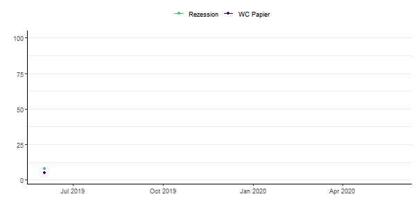
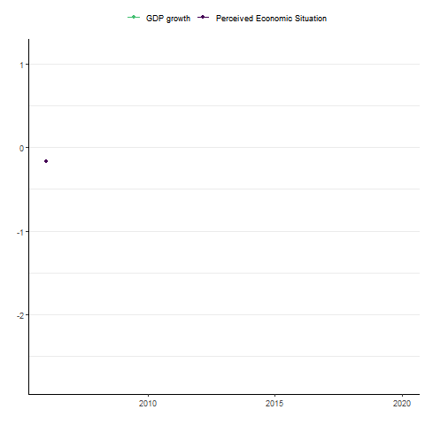
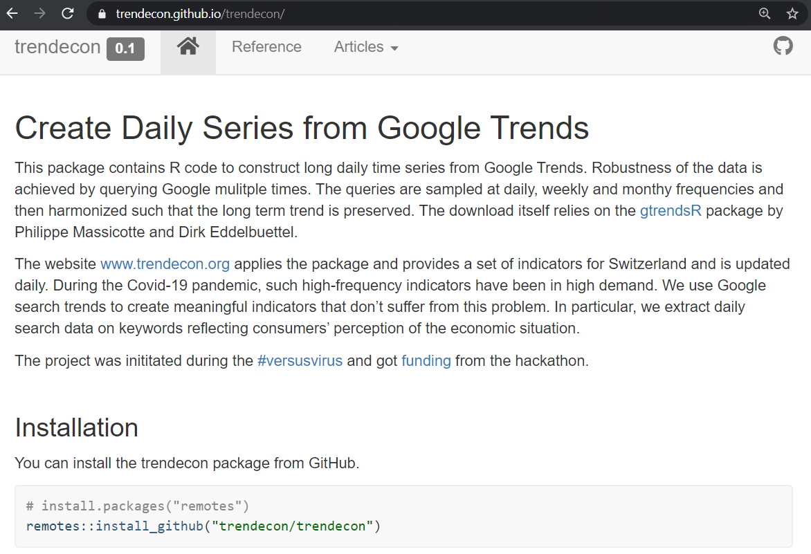
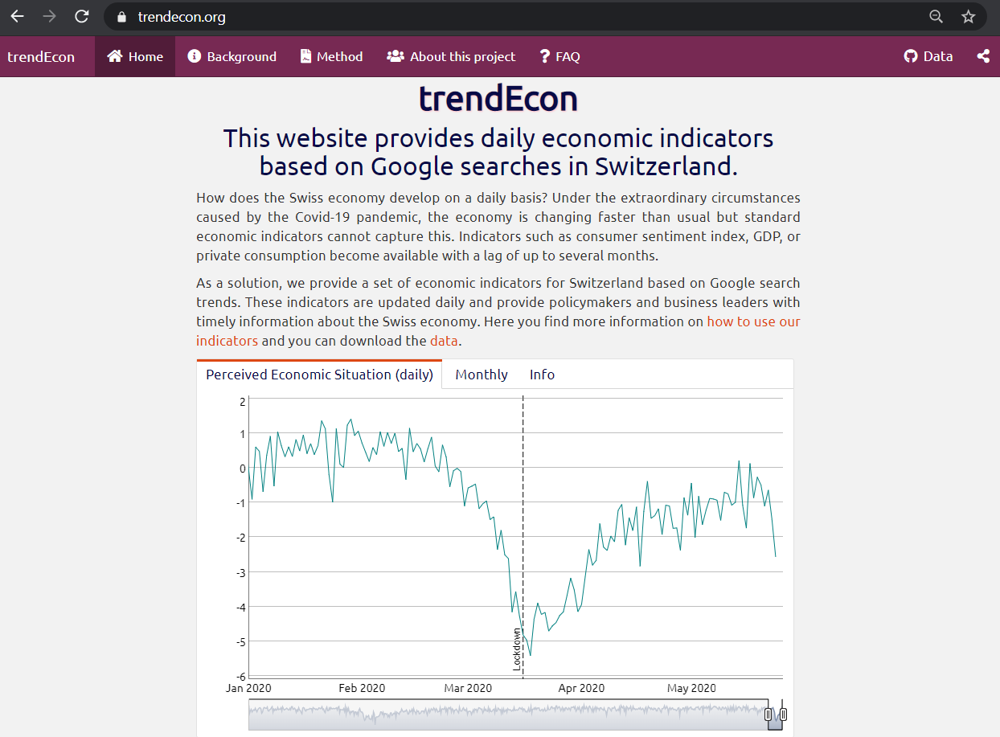

exclude: true
<style type="text/css">
code.r{
  font-size: 16px;
}
pre {
  font-size: 16px !important;
}
</style>
```{r setup, include=FALSE}
options(htmltools.dir.version = FALSE)
```
---
class: bg-main1

# Why trendEcon?
<br><br>

--
### During the Covid-19 pandemic, information about the economic and social situation has changed rapidly. `r emo::ji("metrics")`
<br><br>

--
### Traditional indicators are *not sufficiently frequent* to monitor and forecast economic and social activity at high frequency `r emo::ji("clock")`

---
class: bg-main1

# Our solution

--
### We use Google search trends to overcome this data gap and create meaningful indicators. 

--
### We extract daily search data on keywords reflecting consumers' perception.



---
layout: true
class: split-two with-border border-white

.column[
  .split-three[
  .row.bg-main1[.content.font2[
Indicators based on Google Trends.
  ]]
  .row.bg-main2[.content.font2[
R package .yellow[trendecon]
  ]]
  .row.bg-main3[.content.font2[
Website .yellow[www.trendecon.org] using flexdashboard.
]]
]]

.column.bg-main1[.content.center.vmiddle[
{{content}}
]]

---
class: hide-row2-col1 hide-row3-col1


---
class: hide-row3-col1


---
class:


---
class: fade-row2-col1 fade-row3-col1


---
layout: false
class: bg-main1

# General steps
.blockquote.font_large[
Use Google Trends data for keywords such as “Wirtschaftskrise” and “Insolvenz”. </br></br>
]
 
---
class: bg-main1

# General steps
.blockquote.font_large[
Use Google Trends data for keywords such as “Wirtschaftskrise” and “Insolvenz”. </br></br>
Retrieve Google Trends data through the Google API.</br></br>
]
 
---
class: bg-main1

# General steps
.blockquote.font_large[
Use Google Trends data for keywords such as “Wirtschaftskrise” and “Insolvenz”. </br></br>
Retrieve Google Trends  data through the Google API.</br></br>
Construct indicators.</br></br>
]
 
---
class: bg-main1

# General steps
.blockquote.font_large[
Use Google Trends data for keywords such as “Wirtschaftskrise” and “Insolvenz”. </br></br>
Retrieve Google Trends data through the Google API.</br></br>
Construct indicators.</br></br>
Compare the data to existing economic indicators.</br></br>
]

---
class: middle bg-main1

# It looks very simple....but


---
class: bg-main1

#Sampling issues
##If you query Google Trends for a search term, e.g., insolvenz, the result is based on a subsample of all search results.
</br>
--
```{r, echo=FALSE, fig.height=5, fig.width=15, message=FALSE, warning=FALSE}
library(trendecon)
since2015 <- ts_gtrends("insolvenz", geo = "CH")
since2004 <- ts_gtrends("insolvenz", geo = "CH", time = "all")
tsbox::ts_plot(since2004,since2015)
```
--

---
class: bg-main1

#Available data
</br>
##Google search results are available on a daily, weekly or monthly frequency. 
</br>
##Our goal is to produce long daily time series, ideally from 2006, but Google does not provide daily or weekly data for such a long time period. 

---

